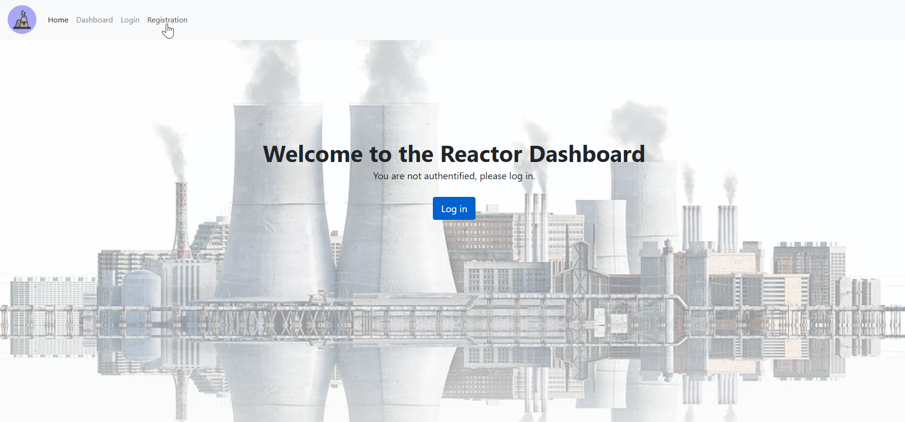
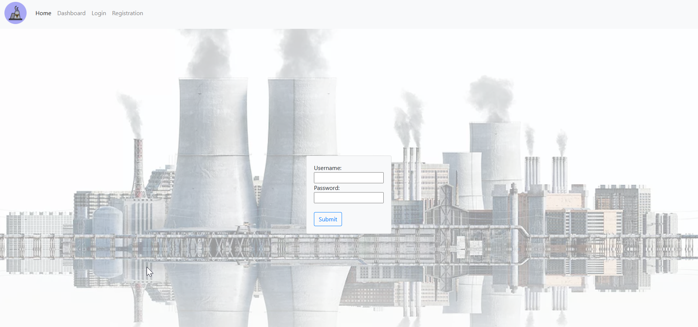
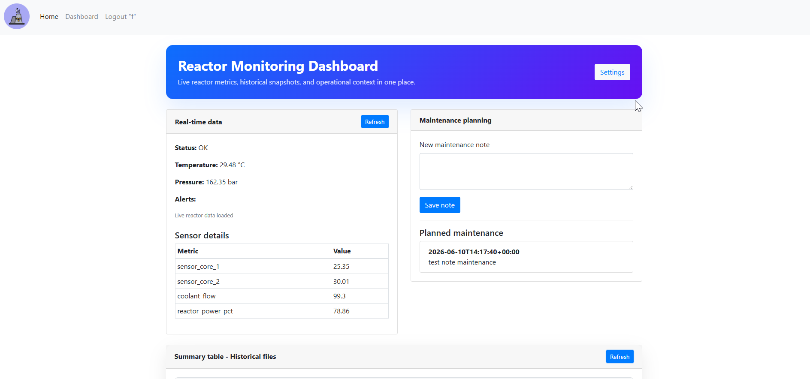

# Telemetry CSE — Reactor Monitoring Platform

A PHP web application for real-time reactor telemetry monitoring. Authenticated users can view live sensor data fetched from an external API, browse historical snapshots, manage maintenance notes, and configure data-storage settings — all from a clean, role-protected dashboard.

---

## Screenshots

### Home page


### Login page


### Reactor dashboard


---

## Features

- **Session-based authentication** — registration, login, and logout with PHP sessions; all dashboard routes are protected.
- **Live reactor metrics** — the dashboard polls a configurable API endpoint (`api_base_url`) and displays status, temperature, pressure, alerts, and a full sensor-detail table.
- **Snapshot storage** — each data fetch is stored as a timestamped JSON file, either locally (`dashboard/storage/`) or in Azure Blob Storage when credentials are configured.
- **Historical file browser** — lists saved snapshots, lets users click to inspect full JSON contents, and renders a summary table across all files.
- **Maintenance notes** — users can add plain-text maintenance notes that are persisted server-side and displayed in a live list.
- **Settings UI** — admins can update the API base URL, polling interval, and Azure Blob SAS credentials without editing files manually.

---

## Project Structure

```
telemetry_cse-main/
├── index.php                  # Landing page — login form or logged-in hero
├── login.php                  # Login handler
├── logout.php                 # Session destroy + redirect
├── registration.php           # Registration page
├── check_login.php            # Credential validation
├── check_registration.php     # New-user creation
├── mysqli_connect.php         # Shared DB connection
├── sql.sql                    # Database schema (users table)
│
├── dashboard/
│   ├── dashboard.php          # Main dashboard UI
│   ├── api_fetch.php          # Fetches live reactor JSON & triggers storage
│   ├── store_data.php         # Writes JSON snapshots locally or to Azure
│   ├── history.php            # Lists and retrieves saved snapshot files
│   ├── maintenance.php        # CRUD for maintenance notes
│   ├── settings.php           # Settings UI (reads/writes settings.json)
│   ├── settings.json          # Runtime config (gitignored in production)
│   ├── maintenance.json       # Persisted maintenance notes
│   └── js/
│       └── dashboard.js       # Client-side polling, rendering, interactions
│
├── enterprise_b_api/          # Mock reactor data provider
│   ├── index.php              # GET — returns generated or override JSON
│   ├── generator.php          # Synthetic sensor data generator
│   ├── update.php             # POST — set override state
│   ├── reset.php              # POST — clear override state
│   ├── state.json             # Override state (created at runtime)
│   └── README.md              # API-specific documentation
│
├── includes/
│   ├── header.html            # HTML <head>, Bootstrap CSS imports
│   ├── footer.html            # Closing scripts (Bootstrap JS, jQuery)
│   ├── navbar.html            # Top navigation bar
│   ├── login.html             # Login form partial
│   ├── registration.html      # Registration form partial
│   ├── logged.php             # Hero section shown to authenticated users
│   ├── notlogged.php          # Hero section for unauthenticated visitors
│   ├── notregistered.php      # Registration prompt partial
│   ├── new_registration.php   # Success/error feedback after registration
│   └── error.php              # Generic error display partial
│
├── assets/
│   ├── css/main.css           # Custom styles
│   └── vendor/                # Bootstrap, Bootstrap Icons, AOS
│
├── css/index.css              # Additional index-page styles
├── javascript/index.js        # Index-page JS
│
├── tests/
│   ├── run_tests.sh           # Shell test runner
│   ├── test_api_generation.php
│   ├── test_api_retrieval.php
│   ├── test_azure_blob.php
│   └── test_table_info_filling.php
│
├── package.json               # Node dependencies (lodash for test tooling)
└── .vscode/settings.json      # Editor config
```

---

## Requirements

- PHP 7.4+ with `curl` and `mysqli` extensions enabled
- MySQL / MariaDB
- A web server (Apache, Nginx, or the PHP built-in server for local dev)
- _(Optional)_ An Azure Blob Storage account for remote snapshot storage

---

## Installation

### 1. Clone the repository

```bash
git clone https://github.com/your-org/telemetry_cse.git
cd telemetry_cse
```

### 2. Create the database

```bash
mysql -u root -p < sql.sql
```

### 3. Configure the database connection

Edit `mysqli_connect.php` with your credentials:

```php
$dbc = mysqli_connect(
    'localhost',   // host
    'your_user',   // username
    'your_pass',   // password
    'picturegallery'
);
```

### 4. Set up the web root

Point your web server's document root at the project folder, or use the PHP built-in server for local development:

```bash
php -S localhost:8080
```

### 5. Configure dashboard settings

Navigate to **Settings** from the dashboard, or edit `dashboard/settings.json` directly:

```json
{
    "api_base_url": "https://your-reactor-api.example.com",
    "poll_interval": 60,
    "azure_blob_url": "",
    "azure_sas_token": ""
}
```

Leave `azure_blob_url` and `azure_sas_token` empty to store snapshots locally in `dashboard/storage/`.

---

## Azure Blob Storage 

When `azure_blob_url` and `azure_sas_token` are provided in `dashboard/settings.json`, each sensor snapshot is uploaded to Azure Blob Storage instead of being written to disk. Leave both fields empty to fall back to local file storage.

---

## Running tests

```bash
cd tests
bash run_tests.sh
```

Individual test files can also be run directly with `php`:

```bash
php tests/test_api_generation.php
php tests/test_api_retrieval.php
```

